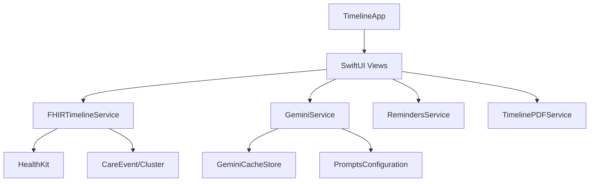

Yari Timeline
========

An iOS app that creates a personal health timeline using HealthKit and AI.

## Features
- Integration with HealthKit clinical records
- AI summaries: readable cluster summaries at multiple literacy levels using AI.
- Artifact viewer: extracts sections from clinical documents and highlights medical terms with plain‑language explanations.
- Doctor questions: generates actionable questions to bring to appointments; optional reminder creation via EventKit.
- Searchable timeline: grouped care events with progressive loading and on‑demand details.
- Caching + usage: on-device caching for AI responses and lightweight usage tracking.
- PDF export: generate shareable timeline PDFs for personal records.

## Firebase Setup
The app uses Google's Firebase for interacting with Vertex AI. To setup Firebase:
- Create a Firebase project (uses a Google Cloud project under the hood). Add an iOS app with your bundle identifier (must match the Xcode target’s bundle ID).
- Download the `GoogleService-Info.plist` for that iOS app and add it to the Xcode project (ensure it’s included in the `Timeline` target and is in the app bundle at build time).
- Initialize Firebase and App Check (already wired in `Timeline/TimelineApp.swift`):
  - `FirebaseApp.configure()`
  - App Check provider factory uses `AppCheckDebugProvider` on Simulator and `AppAttestProvider` on device.
- Enable App Check in the Firebase console for your iOS app:
  - Choose provider: App Attest (recommended for iOS). Keep Debug provider for Simulators during development.
  - Run the app once; capture the logged “App Check debug token” and add it as a Debug token in the Firebase console (App Check → Debug tokens) so simulator requests are accepted.
- Enable Vertex AI for Firebase in the Firebase console:
  - Turn on Vertex AI for the project and select a region. Vertex AI requires billing enabled on the linked Google Cloud project.
  - No API key is needed when using `FirebaseVertexAI`; authentication flows through Firebase + App Check.
- Build and run. If you see App Check errors, confirm:
  - The `GoogleService-Info.plist` matches the bundle ID you’re building.
  - App Check is enabled for the iOS app in the Firebase console.
  - On Simulator, a valid debug token is registered.

## Architecture

## Build
- Simulator: `xcodebuild -project Timeline.xcodeproj -scheme Timeline -destination 'platform=iOS Simulator,name=iPhone 15' build`
- Run in Xcode: open `Timeline.xcodeproj`, select scheme `Timeline`, choose a simulator, and Run.

## Lint
- Style: `swiftlint`
- Unused rules: `swiftlint analyze --strict --compiler-log-path xcodebuild.log`

## CI
- CI is configured in `.github/workflows/ci.yml` to build, lint, and run the analyzer on PRs.

## Creator
- Amir Kiani

## License
MIT — see `LICENSE`.

---

Made with ❤️ in San Francisco
