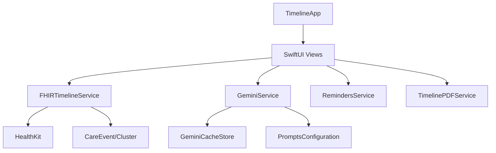

Yari Timeline
========

An iOS app that creates a personal health timeline using HealthKit and AI.

## Features
- Integration with HealthKit clinical records
- AI summaries: readable cluster summaries at multiple literacy levels using AI.
- Artifact viewer: extracts sections from clinical documents and highlights medical terms with plain‑language explanations.
- Doctor questions: generates actionable questions to bring to appointments; optional reminder creation via EventKit.
- Searchable timeline: grouped care events with progressive loading and on‑demand details.
- Caching + usage: on-device caching for AI responses and lightweight usage tracking.
- PDF export: generate shareable timeline PDFs for personal records.

## Firebase Setup
The app uses Firebase AI Logic with the Gemini Developer API and the fixed
`gemini-3.5-flash` model. To set up Firebase:
- Create a Firebase project (uses a Google Cloud project under the hood). Add an iOS app with your bundle identifier (must match the Xcode target’s bundle ID).
- Download the `GoogleService-Info.plist` for that iOS app and add it to the Xcode project (ensure it’s included in the `Timeline` target and is in the app bundle at build time).
- Initialize Firebase and App Check (already wired in `Timeline/TimelineApp.swift`):
  - `FirebaseApp.configure()`
  - App Check provider factory uses `AppCheckDebugProvider` on Simulator and `AppAttestProvider` on device.
- Enable App Check in the Firebase console for your iOS app:
  - Choose provider: App Attest (recommended for iOS). Keep Debug provider for Simulators during development.
  - Run the app once; capture the logged “App Check debug token” and add it as a Debug token in the Firebase console (App Check → Debug tokens) so simulator requests are accepted.
  - Never commit `FIRAAppCheckDebugToken`; if you need a fixed value, keep it in a private user scheme.
- In the Firebase console, open **AI Services → AI Logic**, click **Get started**, and select the **Gemini Developer API** provider.
  - The guided workflow enables the required APIs and securely configures the Gemini API key for the Firebase AI Logic proxy.
  - Do not add a Gemini API key to the app source; requests use Firebase configuration and App Check.
- Build and run. If you see App Check errors, confirm:
  - The `GoogleService-Info.plist` matches the bundle ID you’re building.
  - The Gemini Developer API provider is enabled under Firebase AI Logic.
  - App Check is enabled for the iOS app in the Firebase console.
  - On Simulator, a valid debug token is registered.

## Architecture

```mermaid
flowchart TD
  App[TimelineApp] --> Views[SwiftUI Views]
  Views --> Timeline[FHIRTimelineService]
  Views --> Gemini[GeminiService]
  Views --> Reminders[RemindersService]
  Views --> PDF[TimelinePDFService]

  Timeline --> HealthKit[HealthKit]
  Timeline --> CareEvents[CareEvent/Cluster]

  Gemini --> Cache[GeminiCacheStore]
  Gemini --> Prompts[PromptsConfiguration]
```

## Build
- Simulator: `xcodebuild -project Timeline.xcodeproj -scheme Timeline -destination 'platform=iOS Simulator,name=iPhone 15' build`
- Run in Xcode: open `Timeline.xcodeproj`, select scheme `Timeline`, choose a simulator, and Run.

## Lint
- Style: `swiftlint`
- Unused rules: `swiftlint analyze --strict --compiler-log-path xcodebuild.log`

## CI
- CI is configured in `.github/workflows/ci.yml` to build, lint, and run the analyzer on PRs.

## Creator
- Amir Kiani

## License
MIT — see `LICENSE`.

---

Made with ❤️ in San Francisco
